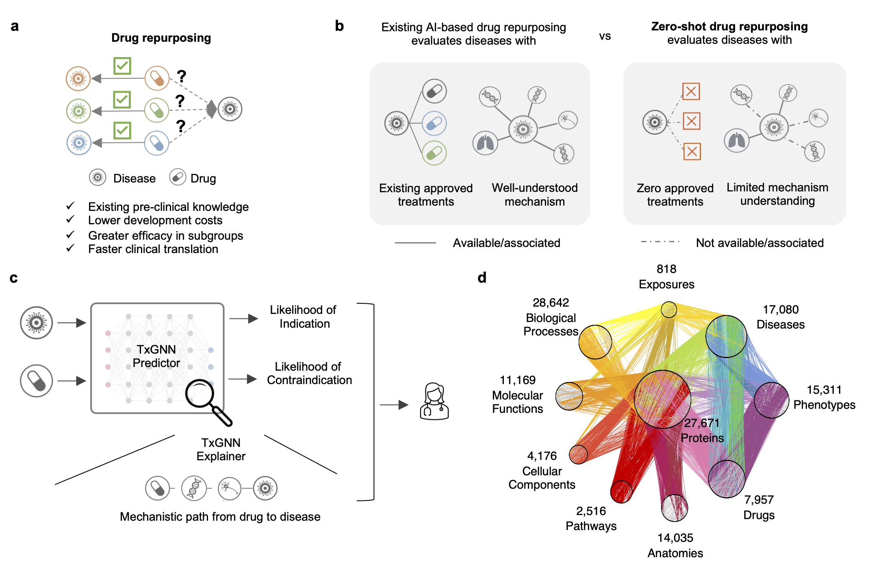

# TxGNN：基于几何深度学习的零样本药物重定向预测

> **课堂教学版本** | 配套教材：第六章·知识图谱与药物重定向

本仓库提供 TxGNN 模型的官方实现，适用于教学演示。TxGNN 利用知识图谱与图神经网络，对罕见病或分子机制不明疾病的治疗方案进行**零样本预测**。

**论文**：[MedRxiv preprint](https://www.medrxiv.org/content/10.1101/2023.03.19.23287458v2)
**在线演示**：[http://txgnn.org](http://txgnn.org/)



---

## 学习目标

1. 理解生物医学知识图谱的构建方式（节点类型、边类型）
2. 掌握如何在异质图上训练图神经网络（GNN）
3. 理解**度量学习（Metric Learning）**如何实现零样本预测
4. 使用 **GraphMask** 对模型预测进行可解释性分析
5. 评估药物重定向模型的性能（AUROC、AUPRC）

---

## 知识背景（5分钟速览）

### TxGNN 解决什么问题？

传统药物研发中，罕见病往往缺乏已知治疗药物，导致模型在这些疾病上缺乏训练数据。
TxGNN 的核心思想：

```
知识图谱 (17,080种疾病 × 7,957种药物)
    → 图神经网络预训练 (学习实体表示)
    → 度量学习微调 (利用相似疾病辅助预测)
    → 零样本推断 (对训练集中无治疗药物的疾病预测)
```

### 知识图谱结构

| 节点类型 | 数量 | 示例 |
|---------|------|------|
| 疾病 (Disease) | 17,080 | 2型糖尿病、阿尔茨海默病 |
| 药物 (Drug) | 7,957 | 二甲双胍、阿司匹林 |
| 基因 (Gene) | ~25,000 | TP53、BRCA1 |
| 其他 | 生物通路、解剖结构等 | — |

**关键边类型**（药物-疾病关系）：
- `indication`：药物适应症（有效）
- `contraindication`：药物禁忌症（有害）
- `off-label use`：超说明书用药

---

## 环境配置

### 第一步：创建 Conda 环境

```bash
conda create --name txgnn_env python=3.8
conda activate txgnn_env
```

### 第二步：安装 PyTorch

访问 [https://pytorch.org/](https://pytorch.org/)，根据你的 CUDA 版本选择安装命令。

> **查看 CUDA 版本**：`nvidia-smi`（右上角显示 CUDA Version）

常用示例（请根据实际选择）：
```bash
# CUDA 11.3
conda install pytorch==1.12.1 torchvision torchaudio cudatoolkit=11.3 -c pytorch

# 仅 CPU（无 GPU 时使用）
conda install pytorch==1.12.1 torchvision torchaudio cpuonly -c pytorch
```

### 第三步：安装 DGL（Deep Graph Library）

```bash
# CUDA 11.3
conda install -c dglteam dgl-cuda11.3==0.5.2

# 仅 CPU
conda install -c dglteam dgl==0.5.2
```

> DGL 版本必须是 **0.5.2**，否则 API 不兼容。

### 第四步：安装 TxGNN

```bash
# 方式一：从本地源码安装（推荐教学使用）
pip install -e .

# 方式二：从 PyPI 安装（稳定版）
pip install TxGNN
```

### 验证安装

```python
from txgnn import TxData, TxGNN, TxEval
print("安装成功！")
```

---

## 快速开始（核心工作流）

完整演示见 [TxGNN_Demo.ipynb](TxGNN_Demo.ipynb)，以下是核心 API 流程：

### Step 1：加载知识图谱数据

```python
from txgnn import TxData, TxGNN, TxEval

# 首次运行会自动下载知识图谱（约400MB），耗时几分钟
TxData = TxData(data_folder_path='./data')

# 创建训练/验证/测试集划分
# split='complex_disease'：测试疾病在训练集中没有任何已知药物（零样本场景）
TxData.prepare_split(split='complex_disease', seed=42, no_kg=False)
```

### Step 2：初始化模型

```python
TxGNN = TxGNN(
    data=TxData,
    weight_bias_track=False,  # 是否使用 wandb 跟踪（教学时关闭）
    proj_name='TxGNN',
    exp_name='TxGNN_demo',
    device='cpu'  # 无 GPU 时改为 'cpu'，有 GPU 改为 'cuda:0'
)

TxGNN.model_initialize(
    n_hid=100,          # 隐层维度
    n_inp=100,          # 输入维度
    n_out=100,          # 输出维度
    proto=True,         # 启用度量学习模块（零样本预测的关键）
    proto_num=3,        # 检索相似疾病数量
    attention=False,    # 关闭注意力层（启用 GraphMask 解释时需关闭）
    sim_measure='all_nodes_profile',  # 疾病相似度计算方式
    agg_measure='rarity'              # 相似疾病嵌入聚合策略
)
```

### Step 3：预训练（可选，耗时较长）

```python
# 在知识图谱的所有30种关系上做链接预测预训练
# 教学演示可跳过，直接加载预训练权重
TxGNN.pretrain(
    n_epoch=2,
    learning_rate=1e-3,
    batch_size=1024,
    train_print_per_n=20
)
```

> 课堂演示时，可直接加载预训练权重：
> ```python
> TxGNN.load_pretrained('./model_ckpt')
> ```

### Step 4：微调（药物-疾病关系）

```python
# 教学演示用 n_epoch=30；正式实验建议 n_epoch=500
TxGNN.finetune(
    n_epoch=30,
    learning_rate=5e-4,
    train_print_per_n=5,
    valid_per_n=20
)
```

**输出说明**：
- `Micro AUROC`：所有药物-疾病对的整体 AUC
- `Macro AUROC`：各疾病平均 AUC（更关注罕见疾病）
- 目标：AUROC > 0.7 表示预测效果良好

### Step 5：保存/加载模型

```python
TxGNN.save_model('./model_ckpt')      # 保存
TxGNN.load_pretrained('./model_ckpt') # 加载
```

### Step 6：可解释性分析（GraphMask）

```python
# 训练 GraphMask 识别对预测重要的知识图谱边
TxGNN.train_graphmask(
    relation='indication',    # 分析适应症预测
    learning_rate=3e-4,
    allowance=0.005,          # 允许的性能损失上限
    epochs_per_layer=5,
    penalty_scaling=1,
    valid_per_n=20
)

# 保存各边的重要性得分（gate值：1=重要，0=不重要）
gates = TxGNN.retrieve_save_gates('./model_ckpt')
TxGNN.save_graphmask_model('./graphmask_model_ckpt')
```

### Step 7：模型评估

```python
from txgnn import TxEval
TxEval = TxEval(model=TxGNN)

# 评估特定疾病（disease_idx 为知识图谱中的节点编号）
result = TxEval.eval_disease_centric(
    disease_idxs=[12661.0, 11318.0],
    relation='indication',
    save_result=False
)

# 评估整个测试集
result = TxEval.eval_disease_centric(
    disease_idxs='test_set',
    show_plot=False,
    verbose=True,
    save_result=True,
    return_raw=False
)
```

---

## 数据集划分说明

`TxData.prepare_split(split='XXX', seed=42)` 支持多种划分策略：

| 划分名称 | 说明 | 适用场景 |
|---------|------|---------|
| `complex_disease` | **推荐**：测试疾病在训练集中无任何已知药物 | 零样本泛化评估 |
| `random` | 随机划分药物-疾病对 | 基线对比 |
| `full_graph` | 使用全部数据训练，无测试集 | 部署前最终训练 |
| `disease_eval` | 屏蔽单个特定疾病 | 单病种评估 |
| 九大疾病领域 | 按疾病本体划分 | 领域特异性评估 |

**九大疾病领域**：`cell_proliferation`、`mental_health`、`cardiovascular`、`anemia`、`adrenal_gland`、`autoimmune`、`metabolic_disorder`、`diabetes`、`neurodigenerative`

---

## 常见问题（FAQ）

**Q：数据下载失败怎么办？**
A：数据从 Harvard Dataverse 自动下载。如网络受限，可手动下载后放置于 `./data/` 目录。

**Q：没有 GPU 可以运行吗？**
A：可以，将 `device='cuda:0'` 改为 `device='cpu'`，但训练会慢很多。演示时建议减少 `n_epoch`（如设为 5）。

**Q：DGL 安装失败？**
A：确认 Python 版本为 3.8，CUDA 版本与安装命令匹配。

**Q：如何查看测试集包含哪些疾病？**
```python
TxEval.retrieve_disease_idxs_test_set('indication')
```

**Q：`proto=True` 和 `proto=False` 有什么区别？**
A：`proto=True` 启用度量学习，通过检索相似疾病的嵌入来增强零样本预测；`proto=False` 退化为普通 GNN，适合作为消融对比基线。

---

## 项目结构

```
TxGNN/
├── TxGNN/                  # 核心模块
│   ├── TxGNN.py            # 主类（训练、评估入口）
│   ├── TxData.py           # 数据加载与划分
│   ├── TxEval.py           # 模型评估
│   ├── model.py            # 神经网络架构
│   ├── utils.py            # 工具函数
│   ├── data_splits/        # 数据划分工具
│   └── graphmask/          # GraphMask 可解释性模块
├── data/
│   └── disease_files/      # 九大疾病领域节点列表
├── reproduce/              # 论文复现脚本
├── TxGNN_Demo.ipynb        # 课堂演示 Notebook ← 从这里开始！
├── requirements.txt        # Python 依赖
└── setup.py                # 包安装配置
```

---

## 引用

```bibtex
@article{huang2023zeroshot,
  title={Zero-shot Prediction of Therapeutic Use with Geometric Deep Learning and Clinician Centered Design},
  author={Huang, Kexin and Chandak, Payal and Wang, Qianwen and Havaldar, Shreyas and Vaid, Akhil and Leskovec, Jure and Nadkarni, Girish and Glicksberg, Benjamin and Gehlenborg, Nils and Zitnik, Marinka},
  journal={medRxiv},
  doi={10.1101/2023.03.19.23287458},
  year={2023}
}
```
